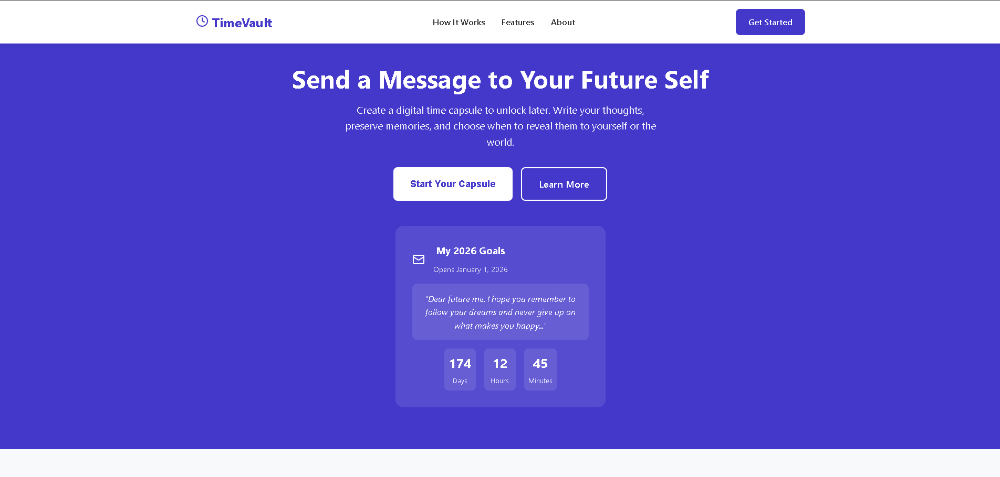
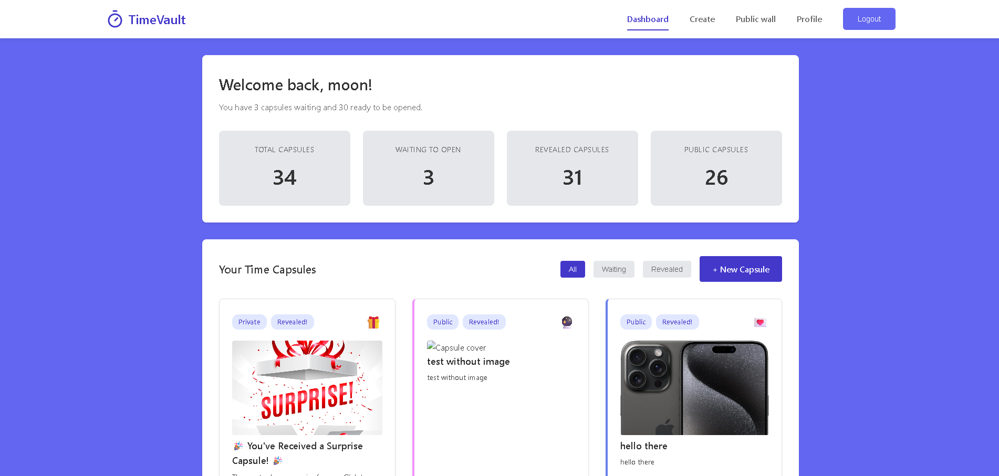
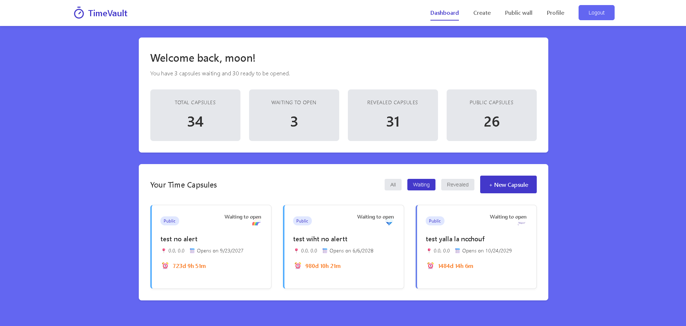
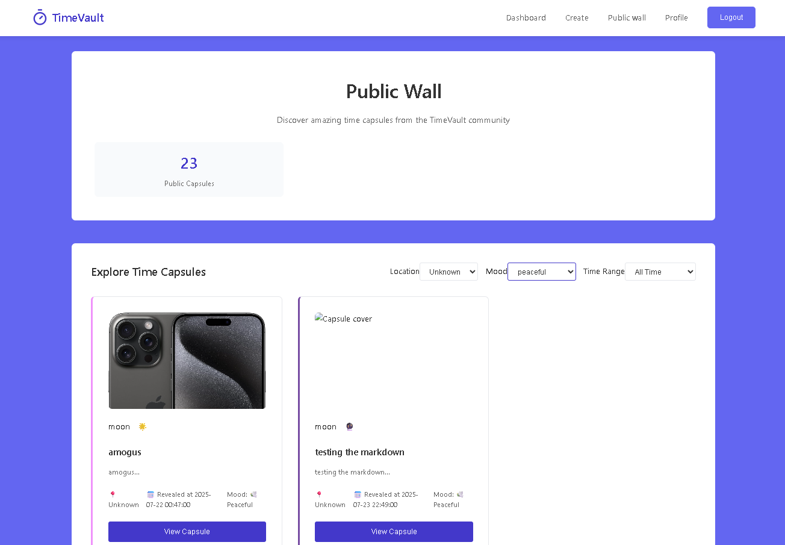
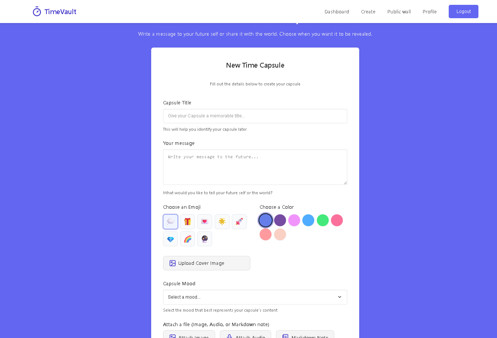
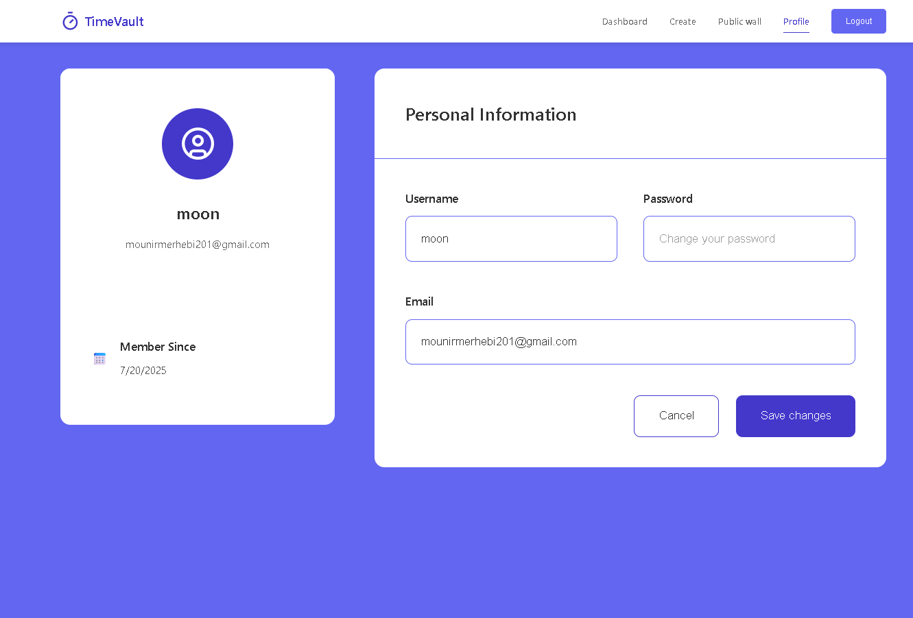

# TimeVault - Digital Time Capsule Platform

## What is TimeVault?

TimeVault is a digital time capsule application that allows users to create, store, and share memories that can be opened at a future date. Think of it as a digital version of burying a time capsule in your backyard, but accessible from anywhere in the world!

## Key Features

### 🕰️ **Time Capsules**
- Create digital time capsules with messages, photos, audio recordings, and text notes
- Set a specific date and time for when your capsule should be "opened"
- Add your current mood and location to remember the moment better
- Customize your capsule with colors and emojis

### 🔒 **Privacy Options**
- **Private**: Only you can see your capsule
- **Public**: Share your capsule with everyone on the public wall
- **Unlisted**: Share with specific people using a special link

### 📍 **Location Features**
- Automatically detect your location when creating a capsule
- Add GPS coordinates for precise location tracking
- Remember where you were when you created each memory

### 🎨 **Rich Media Support**
- Upload cover images and media photos
- Record and attach audio messages
- Add text notes and documents
- Customize colors and emojis for personalization

### 📊 **Dashboard & Analytics**
- View all your time capsules in one place
- Track how many capsules you've created
- See which capsules are waiting to be revealed
- Monitor your public and opened capsules

### 🌍 **Public Wall**
- Discover time capsules shared by other users
- Browse through revealed public capsules
- Get inspired by others' memories and stories

## How It Works

1. **Create an Account**: Sign up with your email and username
2. **Create a Time Capsule**: Write your message, add media, and set a reveal date
3. **Wait**: Your capsule remains locked until the specified date
4. **Reveal**: On the set date, your capsule automatically opens and you receive an email notification
5. **Share**: Optionally share your revealed capsules with others

## Perfect For

- **Personal Memories**: Save special moments to rediscover later
- **Future Self**: Write letters to your future self
- **Family & Friends**: Create shared memories with loved ones
- **Milestones**: Document important life events
- **Creative Projects**: Store ideas and inspirations for later
- **Travel Memories**: Remember places you've been and experiences you've had

## Getting Started

TimeVault is designed to be simple and intuitive. Once you create an account, you can immediately start creating your first time capsule. The platform guides you through each step, making it easy for anyone to preserve their memories digitally.

## User Interface

The application features a clean, modern interface with:
- Easy-to-use dashboard for managing your capsules
- Simple creation process for new time capsules
- Beautiful public wall for discovering others' shared memories
- Responsive design that works on all devices

---

*TimeVault helps you preserve your most precious memories and share them with the world when the time is right.*

### User Screens (Web)

| Landing Page                      | Dashboard                    |
| ---------------------------------- | --------------------------------- |
|  |  |

| Dashboard Filters                      | Public Wall                    |
| ---------------------------------- | --------------------------------- |
|  |  |

| Create Capsule                     | User Profile                   |
| ---------------------------------- | --------------------------------- |
|  |  |

